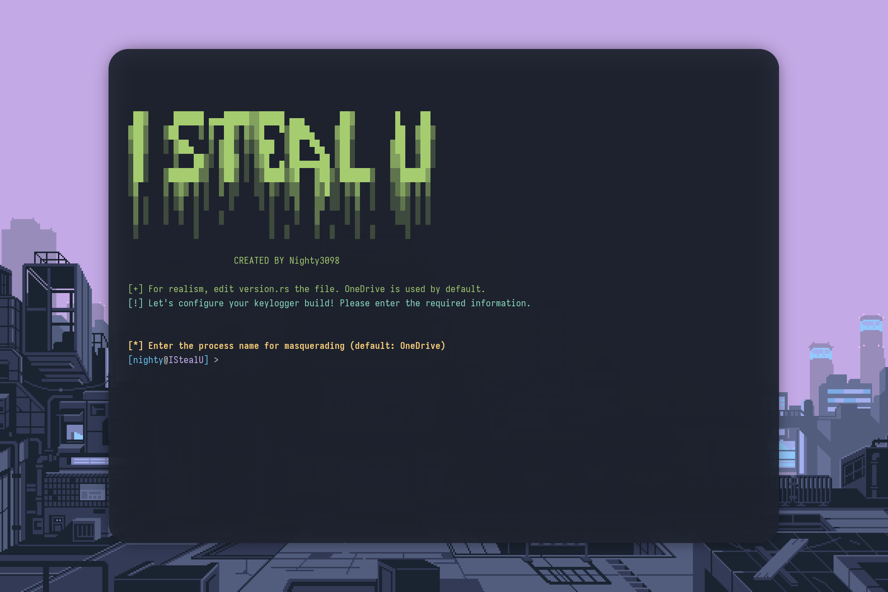
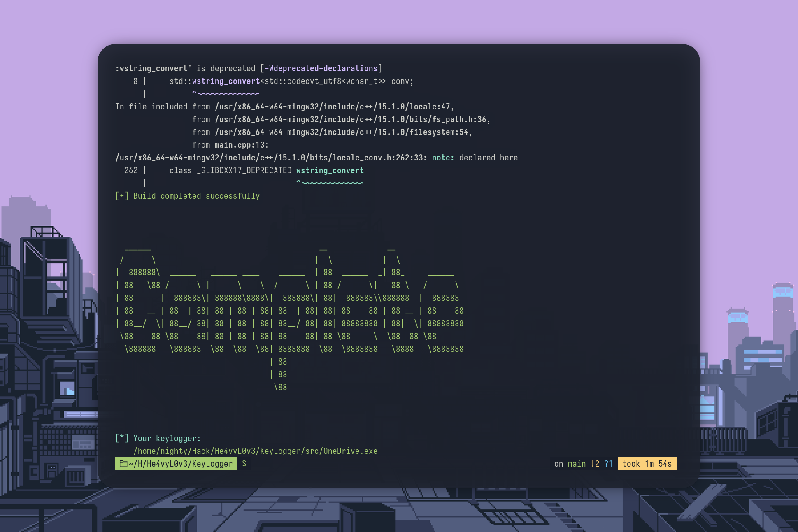

<br /><br />

<br /><br />

# Simple Keylogger

A simple keylogger written in C++ for Windows.

## Features

- Logs all keystrokes, including special keys (Enter, Shift, Ctrl, etc.).
- Saves the active window title and timestamp whenever it changes.
- Writes logs to `keylog.txt` in the `%USERPROFILE%\ILU` directory.
- Optionally hides the console window (if enabled in settings).
- (Optionally) Outputs logs to the console (if enabled in settings).

## Build & Usage

1. Make sure you have a MinGW cross-compiler for Windows installed (e.g., `x86_64-w64-mingw32-g++`).
2. Run the provided build script from the project root:

   ```sh
   bash build.sh
   ```

3. The resulting executable will be named `OneDrive.exe` and placed in the `src/` directory.
4. Run the compiled executable on a Windows machine. The keylogger will start logging keystrokes immediately.
5. Logs are saved to `keylog.txt` in the `ILU` folder inside the user's profile directory.

## Screenshots

<div align="center">




</div>

