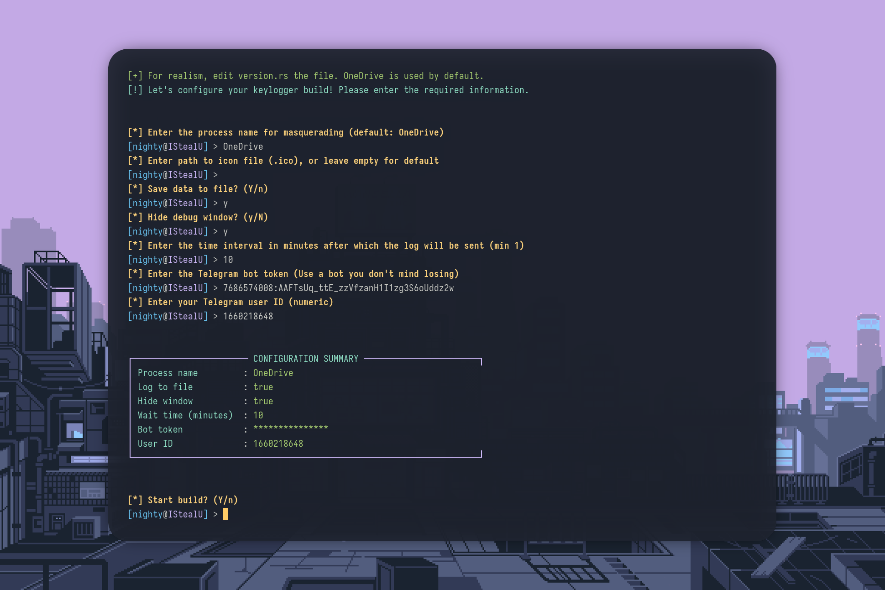

  

  

# ILogU

## Description
ILogU is a spyware program for Windows designed to intercept and log user keystrokes, as well as send logs to Telegram via the Telegram API.

## Main Features
- Logging of all keystrokes, including special keys and layouts.
- Saving logs to the `keylog.txt` file in the user's directory (`%USERPROFILE%\\ILU`).
- Sending logs to a Telegram bot at specified intervals.
- Hidden mode.
- Automatic creation of working folders and files.

## Project Structure
- `src/main.cpp` - entry point, starts the logger and log sending thread.
- `src/logger.cpp` - implements keystroke interception and logging to file.
- `src/send_data.cpp` - sends the file to Telegram via WinHTTP.
- `src/Makefile` - build for Windows (MinGW-w64).
- `src/resources/` - icons and resources for Windows.

## Configuration
To configure and build the project, run the script: `bash build.sh`

# Example

 
 

  

 

## How it works
1. On startup, creates the directory and log file.
2. Starts a thread to send the file to Telegram every 5 minutes (interval can be set in the configurator).
3. The main thread starts the keylogger using WinAPI hooks.
4. All keystrokes are saved to a file and (optionally) printed to the console.
5. The log file is sent to the Telegram bot.

## Project Roadmap
- [ ] Cross-platform support
- [ ] Work with Windows registry and autostart
- [ ] Configurable sending interval
- [ ] Screenshot creation
- [ ] Sending system and environment information
- [ ] Remote keylogger control via Telegram bot

## Important
- Do not use for malicious purposes. The author is not responsible for any consequences.
- To use, you need to create a Telegram bot and find out your chat_id.

## License
MI
