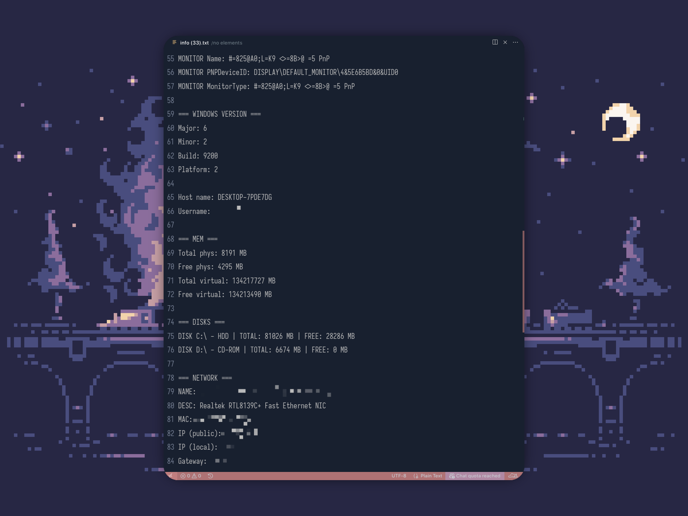

  

  

# ILogU

## Description
ILogU is a spyware program for Windows designed to intercept and log user keystrokes, as well as send logs to Telegram via the Telegram API.

## Main Features
- Logging of all keystrokes, including special keys and layouts.
- Saving logs to the `keylog.txt` file in the user's directory (`%USERPROFILE%\\ILU`).
- Collecting detailed system information and saving it to `info.txt` in the same directory.
- Sending both log and system info files to a Telegram bot at specified intervals.
- Periodic update of system information in `info.txt`.
- Hidden mode.
- Automatic creation of working folders and files.

## Project Structure
- `src/main.cpp` - entry point, starts the logger, log sending thread, and system info collection thread.
- `src/logger.cpp` - implements keystroke interception and logging to file.
- `src/send_data.cpp` - sends files (keylog.txt, info.txt) to Telegram via WinHTTP.
- `src/get_system_info.cpp` - collects detailed system and hardware information, writes to info.txt.
- `src/Makefile` - build for Windows (MinGW-w64).
- `src/resources/` - icons and resources for Windows.

## Configuration
To configure and build the project, run the script: `bash build.sh`

## How it works

1. On startup, creates the working directory and both log (`keylog.txt`) and system info (`info.txt`) files.
2. Immediately collects and writes system information to `info.txt`.
3. Starts a thread to periodically send both `keylog.txt` and `info.txt` to the Telegram bot (interval can be set in the configurator).
4. Starts a separate thread to periodically update `info.txt` with fresh system information.
5. The main thread starts the keylogger using WinAPI hooks.
6. All keystrokes are saved to a file and (optionally) printed to the console.
7. Both log and system info files are sent to the Telegram bot.

 
 

  

 

## Project Roadmap
- [ ] Cross-platform support
- [x] Work with Windows registry and autostart
- [x] Configurable sending interval
- [ ] Screenshot creation
- [x] Sending system and environment information (info.txt)
- [ ] Remote keylogger control via Telegram bot

## Dependencies and Build Notes
- Requires MinGW-w64 for Windows build.
- Uses WinAPI, WinHTTP, and WMI (COM) for system info collection.
- Requires linking with: `-luser32 -lwinhttp -liphlpapi -lsetupapi -lole32 -loleaut32`
- Unicode file paths and wide-character file streams are used for compatibility with non-ASCII user names and paths.

## Important
- Do not use for malicious purposes. The author is not responsible for any consequences.
- To use, you need to create a Telegram bot and find out your chat_id.

## License
MI
